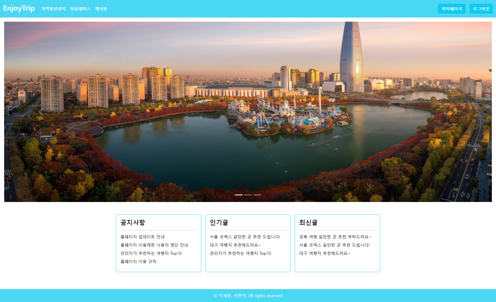

# EnjoyTrip



Spring Boot로 구현한 여행 정보 공유 웹 애플리케이션 입니다.

## Getting Started / 어떻게 시작하나요?

Intellij로 프로젝트를 열고 프로젝트를 빌드하여 실행하시면 됩니다.

+ [EnjoyTrip's Frontend Server](https://github.com/psh3253/enjoytrip_vue)

### Prerequisites / 선행 조건

아래 사항들이 설치 및 세팅이 되어있어야 하며 카카오 로그인을 사용하기 위해서 카카오 REST API 키를 발급하셔야 합니다.

```
MySQL Server 8.0 이상, JDK 17 이상
```

### 카카오 REST API 키 발급 및 설정
1. [Kakao Developers](https://developers.kakao.com/) 사이트에 접속하여 로그인 후 내 애플리케이션 메뉴에 가서 애플리케이션 추가하기를 클릭

2. 앱 이름과 회사 이름을 아무거나 입력하고 저장하여 앱을 생성

3. REST API 키 복사

### 사전 설정
1. /src/main/resources 디렉터리에 존재하는 application.properties 파일에서 위에서 발급받은 카카오 REST API 키와 데이터베이스 접속 정보를 아래와 같이 입력
```
spring.datasource.username=MySQL 사용자명
spring.datasource.password=MySQL 비밀번호
spring.datasource.url=jdbc:mysql://호스트:주소/enjoytrip?serverTimezone=Asia/Seoul&characterEncoding=UTF-8
kakao.rest-api-key=카카오 REST API 키
```


## Built With / 누구랑 만들었나요?

* [박세훈](https://github.com/psh3253) - 프로젝트 설계, 인증 구현, 지역별 관광지 정보, 게시판, 핫플레이스 기능 제작
* [서현덕](https://github.com/hd9775) - 프로젝트 설계, 사용자 프로필 기능 제작, 포로젝트 발표

## Function / 기능
+ 로그인 및 회원가입
+ 지역별 관광지 정보 검색
+ 출발지로부터 관광지까지의 경로, 예상 시간, 거리, 비용 표시
+ 여행 정보 공유 게시판
+ 이미지를 첨부하여 핫플레이스 공유
+ 사용자의 프로필 및 게시글, 댓글단 글, 좋아요 한 글 모아보기

## Technology / 기술

+ Spring Security를 사용하여 JWT 로그인 구현
+ Spring Data JPA를 사용하여 데이터 접근 계층 구현
+ Spring Web Flux와 카카오 모빌리티 길찾기 API를 사용하여 관광지 경로 탐색 구현
+ Kakao Map API를 사용하여 관광지 위치 및 경로를 지도에 표시
+ Vue.js를 사용하여 프로트엔드 서버 구축

## License / 라이센스

이 프로젝트는 GPL-3.0 라이센스로 라이센스가 부여되어 있습니다. 자세한 내용은 LICENSE 파일을 참고하세요.
